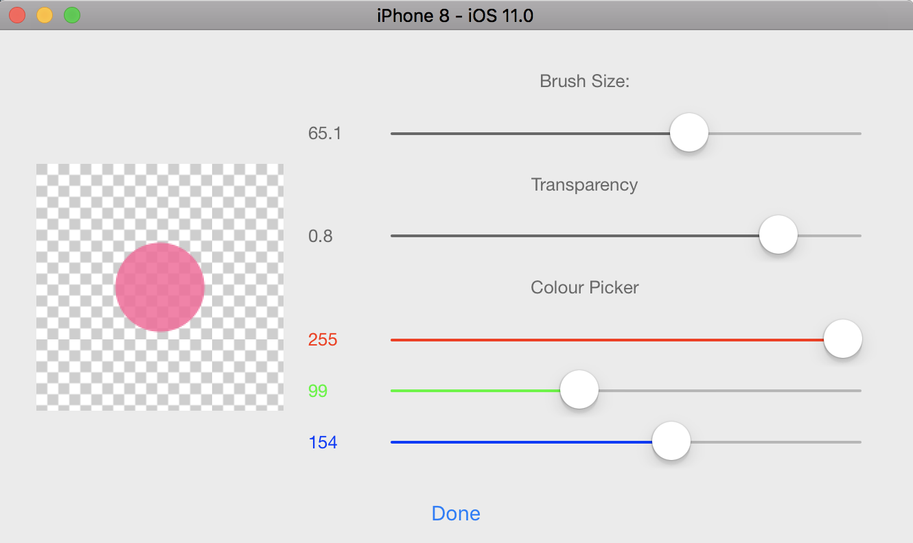

# Technologies learned from AS1 & 2

## 1 List of technologies
### 1.1 Property Observers

```Swift
    var selectedShapeTag: Int = 0 {
        willSet(newTag) {
            shapeButtonArray[newTag].isSelected = true
        }
        didSet(oldTag) {
            if selectedShapeTag != oldTag {
                shapeButtonArray[oldTag].isSelected = false
            }
        }
    }
```
- Property observers observe and respond to changes in a property’s value.
Here the variable “selectdShapeTag” is the property being observed.

- The observer’s body is call every time a property’s value is set, it doesn’t matter if its value changed or not.
There are two kinds of observers willSet and didSet. each property can have either one or both of these observers.

- Here when you change the selectedShapeTag vale, for example into #3,  before the new value is stored into selectedShapeTag, the shapeButtone which has a tag number 3 in an array, is set to Selected.

- Then the variable selectedShapedTag become 3.

- Immediately after this, the didSet snippet is called, so if the new tase is equal to the old tag, we change the old button’s state into unselected.

### 1.2 Delegation
Delegation is a pattern that enables one class to hand off its task to another class.

1. Defining a protocol that encapsulate the responsibilities.

  Below is my Setting View controller.

  The Delegation is used to respond to a particular action, here it is `dissmissView`

  ```Swift
  import UIKit

  protocol SettingsViewControllerDelegate: class {
      func settingsViewControllerFinished(_ settingsViewController: SettingsViewController)
  }

  class SettingsViewController: UIViewController {

      var delegate: SettingsViewControllerDelegate?
      ....
      ....
      @IBAction func dismissView(_ sender: Any) {
        self.dismiss(animated: true, completion: nil)
        self.delegate?.settingsViewControllerFinished(self)
      }
  }
  ```
  


Then the CanvasViewController will adopt and confirm the protocol, and he got the object sent by the settingViewController as `self`, so he got the setting values of every thing: the brush size, color, transparency etc. then all the current setting can be updated.
```Swift
extension CanvasViewController: SettingsViewControllerDelegate {

    func settingsViewControllerFinished(_ settingsViewController: SettingsViewController) {

        if self.currentBrush.red == settingsViewController.redColorValue &&
            self.currentBrush.green == settingsViewController.greenColorValue &&
            self.currentBrush.blue == settingsViewController.blueColorValue {

            // Get new opacty & size
            self.currentBrush.opacty = settingsViewController.opacity
            self.currentBrush.size = settingsViewController.lineWidth

        } else {
            // Get the new color from Setting View
            self.currentBrush.red = settingsViewController.redColorValue
            self.currentBrush.green = settingsViewController.greenColorValue
            self.currentBrush.blue = settingsViewController.blueColorValue

            // remove highlight from color button
            colorButtonArray[selectedColorTag].backgroundColor = UIColor.white
        }
    }
}
```


## 2 Parts could be improved

### 2.1 Method Size

- The codes are too big sometimes, it's not easy to read and maintain.

- Also my code is not neat enough, I think it is because I'm not able to get the most from various beautiful features of Swift language. So just learn more and do more.

### 2.2 comment
- Another thing is annotation or comment. I don't have much sense of when and how to make a useful comment.
This need to do more pratices and I wish somene can shore something about that.


## 3 Apple Human Interface Guideline

- User Standard gestures
- Avoid using standard gestures to perform nonstandard actions.
- Don’t block systemwide screen-edge gestures.
- Offer shortcut gestures to supplement, not replace, interface-based navigation and actions.
- Use multi-finger gestures to enhance the experience of some apps.

## 4 iOS Life Cycle
- Five different Execution states of an App:
    Not running / Inactive / Active / Background / Suspended
- Something about the App Termination
  - Misbehaving or not responding
  - Suspended
  - user can terminate
- Apps must be prepared for termination to happen at any time and should not wait to save user data.

## 5 Comparison between Swift and C#

**BASICS**

**Const is let and var is still var**

```Swift
# Swift
var myVariable = 42
myVariable = 50
let myConstant = 42
```

```CSharp
# C#
var myVariable = 42;
myVariable = 50;
const int myConstant = 42;
```

**COLLECTIONS**
```Swift
# Swift
var shoppingList = ["catfish", "water",
    "tulips", "blue paint"]
shoppingList[1] = "bottle of water"
```

```CSharp
# C#
var shoppingList = new[]{"catfish", "water", "tulips", "blue paint"};
shoppingList[1] = "bottle of water";
```

**Protocol**
```Swift
protocol Nameable {
    func name() -> String
}

func f<T: Nameable>(x: T) {
    println("Name is " + x.name())
}
```

```CSharp
# C#
interface Nameable {
    string name();
}

public void f<T>(T x) where T : Nameable {
    Console.WriteLine("Name is " + x.name());
}
```

**Lambdas and Closures**
```Swift
# Closure Expression Syntax
{ (parameters) -> return type in
    statements
}


# Example
reversedNames = names.sorted(by: { (s1: String, s2: String) -> Bool in
    return s1 > s2
})
```

```CSharp
# C#
# Expression Lambdas
(input-parameters) => expression
(x, y) => x == y

# Statement Lambdas
(input-parameters) => { statement; }
delegate void TestDelegate(string s);
TestDelegate del = n => { string s = n + " World";
                        Console.WriteLine(s); };
```


## What I learned
- How to use SQLiteBrowser to view your CoreData
1. Download and install from http://sqlitebrowser.org

2. Insert follow code to show db file e.g. "AppName".sqlite

```
let storeUrl = appDelegate.persistentContainer.persistentStoreCoordinator.persistentStores.first?.url
print(storeUrl!)
```
file:///Users/xxx/Library/Developer/CoreSimulator/Devices/95E79F65-8DC5-4200-83C7-CE443685D25E/data/Containers/Data/Application/35C1939D-DD2F-4B4E-AF70-6489047977A2/Library/Application%20Support/SmartPen.sqlite

3. Open Termial and locate to that file
`cd /Users/xxx/Library/Developer/CoreSimulator/Devices/95E79F65-8DC5-4200-83C7-CE443685D25E/data/Containers/Data/Application/35C1939D-DD2F-4B4E-AF70-6489047977A2/Library/Application%20Support`

4. run `open .` open that folder

5. copy that three data file to Desktop then in sqlite brower click open DataBase.
